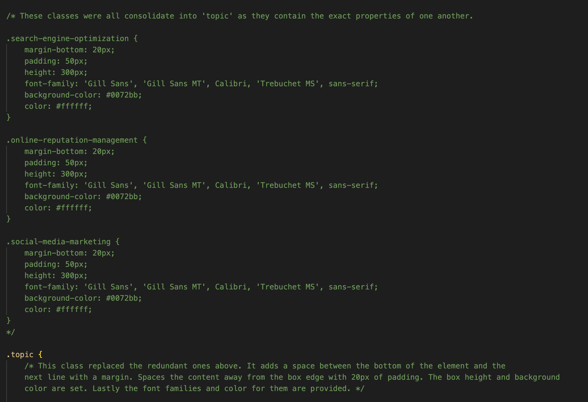

# Bootcamp Challenge 1: An "On-the-job" Ticket to Refactor Code

For our first challenge the students were tasked with downloading source code and creating a new repository for it, then, review it and refactor it to meet the acceptance criteria based on the user story. Both listed below.
When completed the site was published through git pages and can be found by clicking [here](https://ajaws2022.github.io/Bootcamp-Challenge-1/).


### User Story

```
AS A marketing agency
I WANT a codebase that follows accessibility standards
SO THAT our own site is optimized for search engines
```

### Acceptance Criteria

```
GIVEN a webpage meets accessibility standards
WHEN I view the source code
THEN I find semantic HTML elements
WHEN I view the structure of the HTML elements
THEN I find that the elements follow a logical structure independent of styling and positioning
WHEN I view the icon and image elements
THEN I find accessible alt attributes
WHEN I view the heading attributes
THEN they fall in sequential order
WHEN I view the title element
THEN I find a concise, descriptive title
```
---

## Steps Taken

In order to complete this project I wanted to break it down into logical steps rather than scrolling through code and jumping on whatever caught my eye. To do so I took the steps below: 
1. Open the site in my browser to look at its current state and check functionality
2. Make note of anything not working properly.
3. Open DevTools in the browser to see how the CSS corresponded to the HTML in a live setting
4. Open the HTML and CSS in VS code and read through both in a semantic fashion and note where changes could be made.
5. Next I wanted to look for patterns in the HTML page elements to eliminate redundant code in my CSS page.
6. With the patterns and similarities in mind I could begin consolidating classes to clean up the CSS page.
Here are some pictures of two large groups of classes I was able to clean up:
    
    <p>

      ---

      
      
      ---
      
      

      ---
         
    
      </p>

7. After creating the new classes I linked them to the HTML page and opened it in Devtools to ensure everything was still functioning as desired.

| Key Steps | How it Worked |
| ----------- | ----------- |
| 1. | In this case one of the section links in the header was not functioning, and the page had no title |
| 4. | Here I found the title tag had no content inside, and the Search Engine Optimization section had no ID which rendered the link to it useless |
| 5. | There were two main div areas on the page with multiple div areas within each. Every div in the first section shared traits and every one in the second did as well. However, despite these similarities every div had multiple classes in the CSS. |
| 6. | I combined any classes that had equal property values to greatly reduce the volume of code on the CSS page. This will also improve the efficiency of making sitewide changes within the HTML page by linking the new classes.
